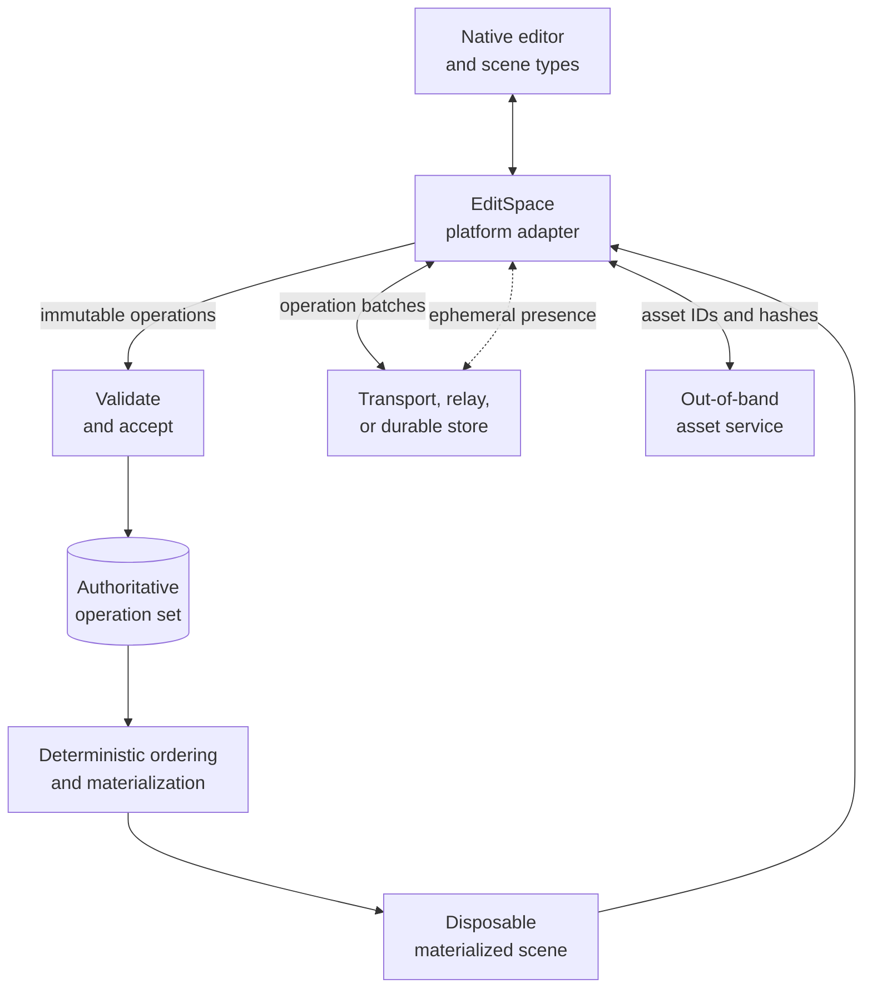

# EditSpace Protocol

[](#use-the-editspace-badge)

EditSpace is a language- and platform-neutral protocol for collaboratively creating and editing shared 3D spaces. A space is a synchronized 3D scene: its objects, transforms, geometry, materials, modifiers, assets, hierarchy, and collaborator presence. This repository is the final abstraction boundary: it defines interoperable data, behavior, and conformance, but contains no EditSpace implementation.

The source of truth is:

- [`SPECIFICATION.md`](SPECIFICATION.md) for normative behavior;
- [`schemas/`](schemas/) for machine-readable wire and result formats;
- [`conformance/`](conformance/) for implementation-independent golden vectors;
- [`tools/editspace-conformance.mjs`](tools/editspace-conformance.mjs) for validating schemas, messages, vectors, and implementation reports.

An implementation belongs in its language or platform repository. It should include this repository as a Git submodule, translate the conformance inputs into its native API, and compare its serialized results with the expected JSON.

The reference Swift implementation is [`graphitedesignlabs/editspace-swift`](https://github.com/graphitedesignlabs/editspace-swift).

## Operation vocabulary

EditSpace represents every durable scene edit as an immutable operation. The operation set is authoritative; deterministic replay produces a disposable materialized scene on every peer.

| Term | Meaning |
| --- | --- |
| Operation | One immutable edit, identified by `op` and authored by `actor` at actor-local `seq`. |
| Dependencies | `deps` name causal predecessors. They constrain replay order but do not grant authority or require a particular transport order. |
| Stamp | The tuple `(seq, actor, op)`, used to order concurrent writes deterministically. |
| `create` | Creates `target`, or writes supplied fields to an existing live target; it never clears a tombstone. |
| `update` | Writes supplied fields to an existing live `target`. Each top-level field is an independent last-writer-wins register. |
| `delete` | Tombstones an existing `target`; history remains in the operation set. |
| `duplicate` | Creates or replaces `target` from a live `source`, then overlays supplied fields. |
| `link` / `unlink` | Adds or removes `target` in a live `source` entity's same-kind link set. |
| Unapplied operation | A preserved operation that cannot affect the current materialized scene, such as an update to a missing target. |

Operations address core scene entities using the kinds `space`, `object`, `mesh`, `vertex`, `face`, `modifier`, `material`, `asset`, `constraint`, `parameter`, and `dependency`. Their `fields` carry interoperable scene properties; `args` carry action metadata; and `features` declare semantics the receiver must support. See the [specification](SPECIFICATION.md) for the complete field vocabulary, validation order, merge rules, and extension behavior.

## Intended architecture



Each implementation maps native scene types to the common JSON protocol at its adapter boundary. Peers may exchange operation batches in any grouping or transport order: acceptance is idempotent, dependencies and operation stamps produce deterministic replay, and the same accepted operation set converges on the same scene. Presence bypasses the durable operation log, while large binary geometry and media travel through an asset channel referenced by stable IDs and hashes.

## Use as a protocol submodule

```sh
git submodule add git@github.com:graphitedesignlabs/EditSpace.git Vendor/EditSpace
git submodule update --init --recursive
cd Vendor/EditSpace
npm test
```

Pin the submodule to a reviewed commit. Do not track an unpinned branch in release builds.

## Validate protocol messages

Node.js 20 or newer is required only for the supplied zero-dependency tooling, not for implementations.

```sh
npm run validate -- path/to/message.json
npm test
```

The validator chooses the envelope schema from its `kind`. `npm test` validates every schema, checks all positive and negative fixtures, and checks the integrity of every conformance vector.

## Check an implementation report

After an implementation runs every vector listed in [`conformance/manifest.json`](conformance/manifest.json), it emits a report matching [`schemas/conformance-report-v1.schema.json`](schemas/conformance-report-v1.schema.json):

```sh
npm run conformance -- path/to/editspace-conformance-report.json
```

The report contains actual acceptance decisions, problem kinds, and normalized materialized states—not self-reported pass flags. The command compares those outputs with the manifest and golden vectors, and fails on a missing, duplicated, or mismatched result. This makes the same protocol suite usable from Swift, Python, JavaScript, Rust, or another implementation without making any one language authoritative.

## Scope

EditSpace defines immutable 3D scene operations, the shared scene-field vocabulary, deterministic ordering and materialization, compatibility behavior, and ephemeral peer presence. It deliberately does not define a renderer, modeling kernel implementation, native scene types, storage engine, network transport, authentication system, asset service, or user interface.

## Use the EditSpace badge

Projects that pass the EditSpace conformance suite may display the EditSpace compliance badge. Add this Markdown to the project's README:

```markdown
[](https://github.com/graphitedesignlabs/EditSpace)
```

## Versioning

Protocol releases use semantic Git tags. Wire messages carry their own integer schema versions. Extensions use open string tokens and must be preserved when they are not understood. See the specification for compatibility requirements.

## License

MIT. See [`LICENSE`](LICENSE).
