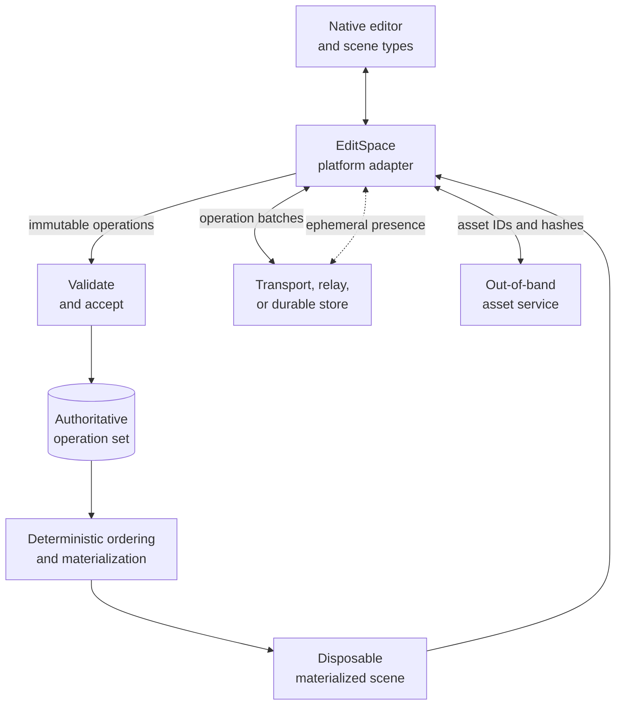
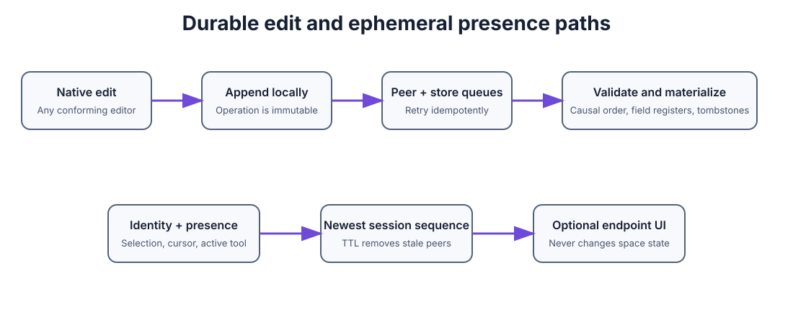

# EditSpace Protocol


EditSpace is a language- and platform-neutral protocol for collaboratively creating and editing shared 3D spaces. A space is a synchronized 3D scene: its objects, transforms, geometry, materials, modifiers, assets, hierarchy, and collaborator presence. This repository is the final abstraction boundary: it defines interoperable data, behavior, and conformance, but contains no EditSpace implementation.

This repository publishes:

- [`SPECIFICATION.md`](SPECIFICATION.md) for normative behavior;
- [`schemas/`](schemas/) for machine-readable wire and result formats;
- [`conformance/`](conformance/) for implementation-independent golden vectors;
- [`tools/editspace-conformance.mjs`](tools/editspace-conformance.mjs) for validating schemas, messages, vectors, and implementation reports.

The maintained source of truth for protocol evolution is the [`editspace-swift`](https://github.com/graphitedesignlabs/editspace-swift) reference implementation. Language-neutral changes are periodically back-applied here, then consumed by implementations through a pinned revision of this repository.

An implementation belongs in its language or platform repository. It should include this repository as a Git submodule, translate the conformance inputs into its native API, and compare its serialized results with the expected JSON.

## Protocol principles

- Operations are truth.
- Snapshots are disposable caches.
- Renderers and modeling applications are adapters.
- Conflicts and compatibility failures are data.
- Unknown future operations are preserved instead of silently overwritten.
- Identity and presence belong to EditSpace, while each endpoint chooses how collaborators appear.

## Operation vocabulary

EditSpace represents every durable scene edit as an immutable operation. The operation set is authoritative; deterministic replay produces a disposable materialized scene on every peer.

| Term | Meaning |
| --- | --- |
| Operation | One immutable edit, identified by `op` and authored by `actor` at actor-local `seq`. |
| Dependencies | `deps` name causal predecessors. They constrain replay order but do not grant authority or require a particular transport order. |
| Stamp | The tuple `(seq, actor, op)`, used to order concurrent writes deterministically. |
| `create` | Creates `target`, or writes supplied fields to an existing live target; it never clears a tombstone. |
| `update` | Writes supplied fields to an existing live `target`. Each top-level field is an independent last-writer-wins register. |
| `delete` | Tombstones an existing `target`; history remains in the operation set. |
| `duplicate` | Creates or replaces `target` from a live `source`, then overlays supplied fields. |
| `link` / `unlink` | Adds or removes `target` in a live `source` entity's same-kind link set. |
| Unapplied operation | A preserved operation that cannot affect the current materialized scene, such as an update to a missing target. |

Operations address core scene entities using the kinds `space`, `object`, `mesh`, `vertex`, `face`, `modifier`, `material`, `asset`, `constraint`, `parameter`, and `dependency`. Their `fields` carry interoperable scene properties; `args` carry action metadata; and `features` declare semantics the receiver must support. See the [specification](SPECIFICATION.md) for the complete field vocabulary, validation order, merge rules, and extension behavior.

## Intended architecture



Each implementation maps native scene types to the common JSON protocol at its adapter boundary. Peers may exchange operation batches in any grouping or transport order: acceptance is idempotent, dependencies and operation stamps produce deterministic replay, and the same accepted operation set converges on the same scene. Presence bypasses the durable operation log, while large binary geometry and media travel through an asset channel referenced by stable IDs and hashes.

### Durable edits and ephemeral presence



## Edit operation packet example

A complete `editspace.operations` wire packet is durable, replayable, and may contain one or more immutable edit operations:

```json
{
  "kind": "editspace.operations",
  "v": 1,
  "doc": "scene-7",
  "ops": [
    {
      "v": 1,
      "doc": "scene-7",
      "op": "ada:42",
      "actor": "ada",
      "seq": 42,
      "deps": ["ada:41"],
      "action": "update",
      "entity": "object",
      "target": "cube-1",
      "fields": {
        "transform.position": [0.0, 1.0, 0.0]
      },
      "args": {},
      "features": ["core.v1", "crud.v1"],
      "producer": {
        "app": "Graphite",
        "appVersion": "1.0",
        "library": "EditSpace",
        "libraryVersion": "0.1"
      },
      "createdAt": "2026-09-03T20:00:00Z"
    }
  ]
}
```

## Protocol definition

Version 1 uses UTF-8 JSON. Transports may frame, compress, encrypt, authenticate, or batch JSON messages, but those choices do not change their contents. Dates are RFC 3339/ISO 8601 strings. Values are JSON null, boolean, finite number, string, array, or object. Binary data is referenced as an asset; it is not embedded in an operation.

### Stable identifiers

| Identifier | Lifetime | Requirement |
| --- | --- | --- |
| `doc` | Shared 3D space | Stable for the collaborative scene; the short wire key is retained for v1 compatibility |
| `actor` | Author installation/account | Stable across reconnects and app launches |
| `op` | Operation | Globally unique and immutable; `actor:seq` is recommended |
| `target` | Entity | Stable for the entity lifetime, including after deletion |
| `peerID` | Person/device presentation identity | Stable enough to recognize a returning collaborator |
| `sessionID` | Live connection | New for each collaboration session |

### Operation members

| Member | Required | Meaning |
| --- | --- | --- |
| `v` | No | Operation schema version; defaults to 1 |
| `doc` | Yes | Shared-space ID; must match the envelope |
| `op` | Yes | Immutable operation ID |
| `actor` | Yes | Author ID |
| `seq` | Yes | Author-local monotonic sequence used in deterministic ordering |
| `deps` | No | Causal predecessor operation IDs; defaults to `[]` |
| `action` | Yes | Extensible action token |
| `entity` | Yes | Extensible entity-kind token |
| `target` | Usually | Entity receiving the operation |
| `source` | For duplicate/link | Source entity |
| `fields` | No | JSON-safe field writes; defaults to `{}` |
| `args` | No | Action-specific, JSON-safe arguments; defaults to `{}` |
| `features` | No | Features required to interpret the operation; defaults to `[]` |
| `producer` | No | Diagnostics and upgrade guidance; never affects merge order |
| `createdAt` | No | Informational wall-clock time; never affects merge order |

Core actions are `create`, `update`, `delete`, `duplicate`, `link`, and `unlink`. Core scene entities are `space`, `object`, `mesh`, `vertex`, `face`, `modifier`, `material`, `asset`, `constraint`, `parameter`, `dependency`, and `legacySnapshot`. `document` is accepted only as an early-v1 compatibility token.

The protocol defines concrete 3D fields rather than leaving `fields` opaque: right-handed Y-up meter coordinates; vec2/vec3/vec4 and column-major matrix encodings; object transforms and hierarchy; bulk meshes and stable vertex/face entities; modifier inputs; metallic/roughness PBR materials; and hashed assets. See [the normative shared-scene model](SPECIFICATION.md#34-shared-3d-scene-model).

### Deterministic merge

Implementations MUST:

1. treat an operation ID and its content as immutable;
2. ignore an exact duplicate operation;
3. report an operation-ID collision if the same ID has different content;
4. order known causal predecessors before dependants;
5. break concurrent ties by `(seq, actor, op)` in ascending lexical order;
6. resolve each field independently using the greatest operation stamp;
7. represent deletion with a tombstone operation, never by deleting history;
8. preserve unsupported operations and avoid applying them destructively.

Missing dependencies do not block synchronization indefinitely. Implementations order the known subset causally and use operation-stamp order for missing or cyclic dependency sets. A receiver may request missing history before materialization.

### Peer identity and presence

Identity is part of EditSpace because collaborator presentation must work consistently across conforming endpoints. Presence remains separate from durable scene state: it expires, is never replayed into a space, and may be hidden entirely by an endpoint.

```json
{
  "kind": "editspace.presence",
  "v": 1,
  "doc": "scene-7",
  "presence": {
    "identity": {
      "peerID": "device-d761",
      "actorID": "ada",
      "displayName": "Ada",
      "color": "#8B5CF6",
      "avatarURL": null,
      "attributes": {
        "endpoint": "editor"
      }
    },
    "sessionID": "session-f02b",
    "state": "active",
    "sequence": 18,
    "selectedEntities": [
      { "kind": "object", "id": "cube-1" }
    ],
    "focus": {
      "rayOrigin": [0.0, 1.6, 0.0],
      "rayDirection": [0.0, 0.0, -1.0]
    },
    "updatedAt": "2026-09-03T20:00:02Z",
    "timeToLiveSeconds": 15
  }
}
```

Presence rules:

- `actorID` links presentation identity to authored operations.
- A receiver retains only the greatest `sequence` for each `sessionID`.
- A record expires at `updatedAt + timeToLiveSeconds`.
- `offline` removes the session immediately.
- `selectedEntities` and `focus` are hints. They grant no permissions and change no model state.
- `displayName`, `color`, `avatarURL`, and arbitrary attributes are untrusted presentation data.
- An endpoint chooses whether to show names, avatars, cursors, selections, cameras, or nothing.

### Compatibility

An implementation declares supported schema versions, actions, entity kinds, and feature tokens. Unsupported input is retained in the immutable log or quarantine store with a structured problem:

- `unsupportedSchema`
- `unsupportedAction`
- `unsupportedEntity`
- `unsupportedFeature`
- `spaceMismatch`
- `invalidOperation`
- `operationIDCollision`

## Implementation guidance

Implementations should begin with the JSON Schemas and golden fixtures. Timestamps must be emitted in UTC RFC 3339 form, sequence values must remain signed 64-bit integers, dictionary order must never affect semantics, and operation equality must compare decoded semantic content.

An adapter should map native scene changes to operations, apply remote state on the platform's required execution context, keep the operation log separate from the render graph, and treat presence updates as disposable UI data.

## Use as a protocol submodule

```sh
git submodule add git@github.com:graphitedesignlabs/EditSpace.git Vendor/EditSpace
git submodule update --init --recursive
cd Vendor/EditSpace
npm test
```

Pin the submodule to a reviewed commit. Do not track an unpinned branch in release builds.

## Validate protocol messages

Node.js 20 or newer is required only for the supplied zero-dependency tooling, not for implementations.

```sh
npm run validate -- path/to/message.json
npm test
```

The validator chooses the envelope schema from its `kind`. `npm test` validates every schema, checks all positive and negative fixtures, and checks the integrity of every conformance vector.

## Check an implementation report

After an implementation runs every vector listed in [`conformance/manifest.json`](conformance/manifest.json), it emits a report matching [`schemas/conformance-report-v1.schema.json`](schemas/conformance-report-v1.schema.json):

```sh
npm run conformance -- path/to/editspace-conformance-report.json
```

The report contains actual acceptance decisions, problem kinds, and normalized materialized states—not self-reported pass flags. The command compares those outputs with the manifest and golden vectors, and fails on a missing, duplicated, or mismatched result. This makes the same protocol suite usable from Swift, Python, JavaScript, Rust, or another implementation without making any one language authoritative.

## Scope

EditSpace defines immutable 3D scene operations, the shared scene-field vocabulary, deterministic ordering and materialization, compatibility behavior, and ephemeral peer presence. It deliberately does not define a renderer, modeling kernel implementation, native scene types, storage engine, network transport, authentication system, asset service, or user interface.

## Use the EditSpace compatibility badge

Projects that pass the EditSpace conformance suite may display the EditSpace compatibility badge.

<a href="https://github.com/graphitedesignlabs/EditSpace">
  <picture>
    <source media="(prefers-color-scheme: dark)" srcset="editspacecompatible-dark.png">
    <source media="(prefers-color-scheme: light)" srcset="editspacecompatible-light.png">
    
  </picture>
</a>

Add this HTML to the project's README:

```html
<a href="https://github.com/graphitedesignlabs/EditSpace">
  <picture>
    <source media="(prefers-color-scheme: dark)" srcset="https://raw.githubusercontent.com/graphitedesignlabs/EditSpace/main/editspacecompatible-dark.png">
    <source media="(prefers-color-scheme: light)" srcset="https://raw.githubusercontent.com/graphitedesignlabs/EditSpace/main/editspacecompatible-light.png">
    
  </picture>
</a>
```

## Versioning

Protocol releases use semantic Git tags. Wire messages carry their own integer schema versions. Extensions use open string tokens and must be preserved when they are not understood. See the specification for compatibility requirements.

## License

MIT. See [`LICENSE`](LICENSE).
